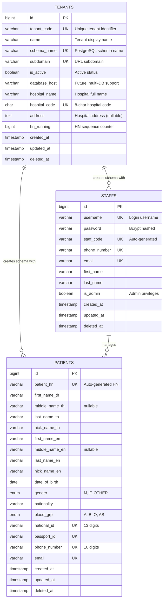

# ER Diagram - Hospital Information System

## Multi-Tenant Database Architecture



## Schema Isolation Architecture

```
┌─────────────────────────────────────────────────────────────────────────────┐
│                           PostgreSQL Database                                │
├─────────────────────────────────────────────────────────────────────────────┤
│                                                                              │
│   ┌─────────────────────┐                                                   │
│   │   public schema     │ ← Shared across all tenants                       │
│   │   ┌───────────────┐ │                                                   │
│   │   │   tenants     │ │ ← Tenant registry & hospital settings             │
│   │   │   migrations  │ │ ← Migration tracking                              │
│   │   └───────────────┘ │                                                   │
│   └─────────────────────┘                                                   │
│                                                                              │
│   ┌─────────────────────┐   ┌─────────────────────┐   ┌─────────────────┐  │
│   │ tenant_bangkok      │   │ tenant_chiangmai    │   │ tenant_xxx      │  │
│   │ ┌───────────────┐   │   │ ┌───────────────┐   │   │ ...             │  │
│   │ │   staffs      │   │   │ │   staffs      │   │   │                 │  │
│   │ │   patients    │   │   │ │   patients    │   │   │                 │  │
│   │ └───────────────┘   │   │ └───────────────┘   │   │                 │  │
│   └─────────────────────┘   └─────────────────────┘   └─────────────────┘  │
│         ↑                         ↑                                         │
│   Complete data                Complete data                                │
│   isolation                    isolation                                    │
│                                                                              │
└─────────────────────────────────────────────────────────────────────────────┘
```

## HN (Hospital Number) Generation Flow

```
┌────────────────┐     ┌─────────────────────┐     ┌──────────────────────┐
│  Create        │     │  Tenant Service     │     │  Patient Created     │
│  Patient       │────▶│  GenerateHN()       │────▶│  with HN             │
│  Request       │     │                     │     │                      │
└────────────────┘     └─────────────────────┘     └──────────────────────┘
                              │
                              ▼
                       ┌─────────────────────┐
                       │ 1. Get tenant by    │
                       │    schema_name      │
                       │                     │
                       │ 2. Atomic increment │
                       │    hn_running       │
                       │                     │
                       │ 3. Format HN:       │
                       │    {hospital_code}- │
                       │    {hn_running}     │
                       │    (zero-padded)    │
                       └─────────────────────┘

Example: BKGH0001-000001, BKGH0001-000002, ...
```

## Table Details

### Tenants Table (Public Schema)

| Column | Type | Constraints | Description |
|--------|------|-------------|-------------|
| id | BIGINT | PK, AUTO_INCREMENT | Primary key |
| tenant_code | VARCHAR(50) | UNIQUE, NOT NULL | Unique tenant identifier |
| name | VARCHAR(100) | NOT NULL | Display name |
| schema_name | VARCHAR(50) | UNIQUE, NOT NULL | PostgreSQL schema name |
| subdomain | VARCHAR(50) | UNIQUE, NOT NULL | URL subdomain |
| is_active | BOOLEAN | DEFAULT true | Active status |
| database_host | VARCHAR(255) | DEFAULT '' | Future multi-DB support |
| hospital_name | VARCHAR(150) | NOT NULL | Hospital full name |
| hospital_code | CHAR(8) | UNIQUE, NOT NULL | Hospital code for HN |
| address | TEXT | NULLABLE | Hospital address |
| hn_running | BIGINT | DEFAULT 0 | HN sequence counter |
| created_at | TIMESTAMP | | Record creation time |
| updated_at | TIMESTAMP | | Last update time |
| deleted_at | TIMESTAMP | NULLABLE | Soft delete |

### Staffs Table (Tenant Schema)

| Column | Type | Constraints | Description |
|--------|------|-------------|-------------|
| id | BIGINT | PK, AUTO_INCREMENT | Primary key |
| username | VARCHAR(100) | UNIQUE, NOT NULL | Login username |
| password | VARCHAR(255) | NOT NULL | Bcrypt hashed password |
| staff_code | VARCHAR(20) | UNIQUE, NOT NULL | Auto-generated code |
| phone_number | VARCHAR(20) | UNIQUE, NOT NULL | Contact phone |
| email | VARCHAR(255) | UNIQUE, NOT NULL | Email address |
| first_name | VARCHAR(255) | NOT NULL | First name |
| last_name | VARCHAR(255) | NOT NULL | Last name |
| is_admin | BOOLEAN | DEFAULT false | Admin privileges |
| created_at | TIMESTAMP | | Record creation time |
| updated_at | TIMESTAMP | | Last update time |
| deleted_at | TIMESTAMP | NULLABLE | Soft delete |

### Patients Table (Tenant Schema)

| Column | Type | Constraints | Description |
|--------|------|-------------|-------------|
| id | BIGINT | PK, AUTO_INCREMENT | Primary key |
| patient_hn | VARCHAR(20) | UNIQUE, NOT NULL | Auto-generated HN |
| first_name_th | VARCHAR(255) | NOT NULL | Thai first name |
| middle_name_th | VARCHAR(255) | NULLABLE | Thai middle name |
| last_name_th | VARCHAR(255) | NOT NULL | Thai last name |
| nick_name_th | VARCHAR(50) | NOT NULL | Thai nickname |
| first_name_en | VARCHAR(255) | NOT NULL | English first name |
| middle_name_en | VARCHAR(255) | NULLABLE | English middle name |
| last_name_en | VARCHAR(255) | NOT NULL | English last name |
| nick_name_en | VARCHAR(50) | NOT NULL | English nickname |
| date_of_birth | DATE | NOT NULL | Birth date |
| gender | ENUM | NOT NULL | M, F, OTHER |
| nationality | VARCHAR(100) | NOT NULL | Nationality |
| blood_grp | ENUM | NOT NULL | A, B, O, AB |
| national_id | VARCHAR(13) | UNIQUE | Thai National ID |
| passport_id | VARCHAR(20) | UNIQUE | Passport number |
| phone_number | VARCHAR(10) | UNIQUE | Contact phone |
| email | VARCHAR(255) | UNIQUE | Email address |
| created_at | TIMESTAMP | | Record creation time |
| updated_at | TIMESTAMP | | Last update time |
| deleted_at | TIMESTAMP | NULLABLE | Soft delete |
